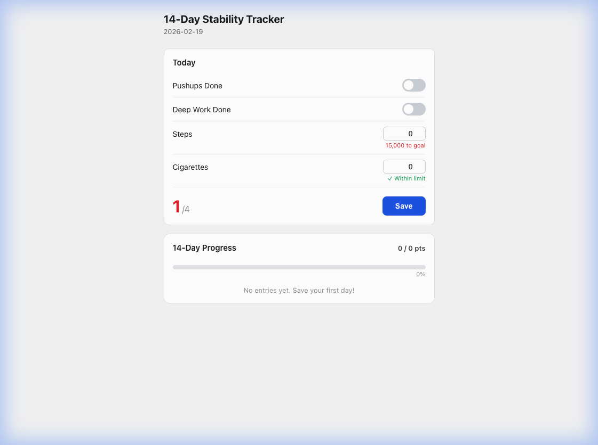

# 14-Day Stability Tracker

A personal daily habit tracker built with **React + Vite + Supabase**. Track 4 metrics—pushups, deep work, steps, and cigarettes—score each day out of 4, and visualize your 14-day progress.



## Features

- ✅ Toggle tracking for **Pushups** and **Deep Work**
- 🔢 Number inputs for **Steps** (15k goal) and **Cigarettes** (≤3 limit)
- 📊 Daily score out of 4
- 📈 14-day progress bar with history
- ☁️ Data persistence via **Supabase** (Postgres)
- 🔐 Environment variables for secrets (`.env`)

## Tech Stack

- **React 19** — UI
- **Vite 7** — Build tool + dev server
- **Supabase** — Backend (REST API + Postgres)

## Setup

### 1. Clone & Install

```bash
git clone https://github.com/iamsumitmandloi/14_days_proto.git
cd 14_days_proto
npm install
```

### 2. Configure Supabase

Create a `.env` file at the project root:

```env
VITE_SUPABASE_URL=https://your-project-ref.supabase.co
VITE_SUPABASE_ANON_KEY=your-anon-key-here
```

### 3. Create the Database Table

In your [Supabase SQL Editor](https://supabase.com/dashboard), run:

```sql
create table stability_logs (
  date text primary key,
  pushups_done boolean default false,
  deep_work_done boolean default false,
  steps_count integer default 0,
  cigarettes_count integer default 0,
  score integer default 0
);

alter table stability_logs disable row level security;
```

### 4. Run

```bash
npm run dev
```

Open [http://localhost:5173](http://localhost:5173)

## License

MIT
